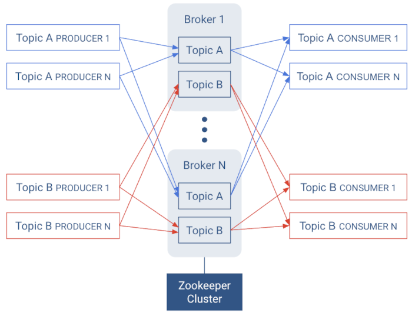
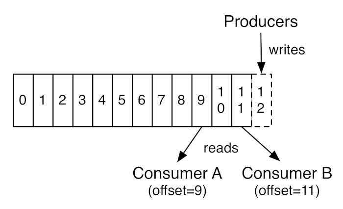
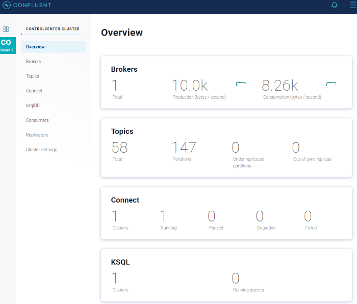

# kafka overview
- kafka explained : http://cloudurable.com/blog/what-is-kafka/index.html

---

- architecture: 

---

- topics / producers / consumers: 

---

- confluent Stack on [localhost](http://localhost:9021)

---

# simple kafka

--

## create topic
- on confluent [control-center](http://localhost:9021): testtopic

## consumer / producer
(monitor topic messages and lags)
- run simple producer with 10 records
- monitor messages on control-center
- run simple consumer
- run simple producer with 100 records
- monitor lag on control-center
- run simple consumer

---
* producer

    The producers sends data (records with key/value definition) to the broker. The broker
    stores data and provides the date to a _customer_.
    
    ```scala
    val kafkaProps = new Properties()
    kafkaProps.put("bootstrap.servers",     "localhost:9092");
    kafkaProps.put("key.serializer",        "org.apache.kafka.common.serialization.StringSerializer")
    kafkaProps.put("value.serializer",      "org.apache.kafka.common.serialization.StringSerializer")
    val producer = new KafkaProducer[String, String](kafkaProps);
    val record = new ProducerRecord[String, String]("topicname", null, "My record")
    producer.send(record)
    ```

---
* consumer 

    The consumer defines a group for which a record pointer is maintained. Everytime a consumer
    with of same group reads data, the record pointer of the group will be increased.
    
    The consumer isn't working as an event endpoint, but polls the data from the broker.
        
    ```scala
    kafkaProps.put("bootstrap.servers", "localhost:9092")
    kafkaProps.put("group.id", "consumer_grp1" )
    kafkaProps.put("key.deserializer", "org.apache.kafka.common.serialization.StringDeserializer")
    kafkaProps.put("value.deserializer", "org.apache.kafka.common.serialization.StringDeserializer")
    kafkaProps.put("max.poll.records", 3)
    val consumer = new KafkaConsumer[String, String](kafkaProps)
    consumer.subscribe(List("topicname").asJava)
    val consumerRecords = consumer.poll(500.millis.toJava)
    if (consumerRecords.count() > 0) {
      consumerRecords.forEach { record =>
        println(s"record(${record.key()}) = ${record.value()}")
      }
      consumer.commitAsync()
    }
    ```

---
# in depth

--

## kafka components 

_docker-compose.yml_

- **zookeeper**(free): manage kafka brokers 
- **broker**(free): one or multiple instances of kafka broker
- **schema-registry**(free): avro schema reistry
- **connect**: one or multiple instances of connector server. The server per se 
is free, but some connectors are licensed by _confluent_
- **control-center**(confluent): UI  
- **ksql components**(confluent): SQL like tool for topic aggregation
- **rest-proxy**(confluent): rest api for topic producer and consumers

--
- **mysql_kafka**: demo database
- **flyway**: flyway migration executor
- **rest**: simple rest demo

---
## schemas (avro)
- create new connector _kafak-connectors/connector_test_config.json_
- add some entries via mysql for _MyTest_ table
- monitor topic and schemas on confluent
- run _avroConsumer_

---
* jdbc source connector
  ```json
    {
      "name": "jdbcsink",
      "config": {
        "connector.class": "io.confluent.connect.jdbc.JdbcSinkConnector",
        "tasks.max": "1",
        "errors.log.enable": true,
        "errors.log.include.messages": true,
        "topics": "jdbcpipe",
        "auto.create": true,
        "auto.evolve": true,
        "connection.url": "jdbc:mysql://172.166.1.30:3306/db1",
        "connection.user": "root",
        "connection.password": "root",
        "dialect.name": "MySqlDatabaseDialect",
        "insert.mode": "insert",
        "batch.size": "1",
        "table.name.format": "kafka_${topic}",
        "pk.mode": "kafka",
        "fields.whitelist": "msg"
      }
    }
  ```

---
* avro consumer
  ```scala
  val kafkaProps = new Properties()
  kafkaProps.put("bootstrap.servers", "localhost:9092")
  kafkaProps.put("group.id", "group2" )
  kafkaProps.put("key.deserializer", "org.apache.kafka.common.serialization.StringDeserializer")
  kafkaProps.put("value.deserializer", "io.confluent.kafka.serializers.KafkaAvroDeserializer")
  kafkaProps.put("schema.registry.url", "http://172.166.1.22:8081")
  kafkaProps.put("max.poll.records", 1)
  val consumer = new KafkaConsumer[String, GenericRecord](kafkaProps)
  consumer.subscribe(List(topic).asJava)
  while (true) {
        val consumerRecords = consumer.poll(500.millis.toJava)
        if (consumerRecords.count() > 0) {
          consumerRecords.forEach { record =>
            val item:GenericRecord = record.value()
            val name = item.get("name")
            val id = item.get("id")
            val ts = item.get("ts")
            println(s"$id:$name/$ts")
          }
          consumer.commitAsync()
        } 
  }
  ```

---
- create new connector _kafak-connectors/connector_jdbcsink_config.json_
- monitor database
- run _avroProducer_

---
* jdbc sink connector
  ```json
    {
      "name": "jdbcsink",
      "config": {
        "connector.class": "io.confluent.connect.jdbc.JdbcSinkConnector",
        "tasks.max": "1",
        "errors.log.enable": true,
        "errors.log.include.messages": true,
        "topics": "jdbcpipe",
        "auto.create": true,
        "auto.evolve": true,
        "connection.url": "jdbc:mysql://172.166.1.30:3306/db1",
        "connection.user": "root",
        "connection.password": "root",
        "dialect.name": "MySqlDatabaseDialect",
        "insert.mode": "insert",
        "batch.size": "1",
        "table.name.format": "kafka_${topic}",
        "pk.mode": "kafka",
        "_pk.fields": "__connect_offset",
        "fields.whitelist": "msg"
      }
    }
  ```
  
---
* avro producer
  ```scala
  val schema = "{\"type\":\"record\",\"name\":\"Echo\",\"namespace\":\"my.simpleREST.Messages\",\"fields\":[{\"name\":\"msg\",\"type\":\"string\"}]}"
  val avroSchema = new Schema.Parser().parse(schema)
  def buildRecord(msg:String) = {
        val record = new GenericData.Record(avroSchema)
        record.put("msg", msg)
        record
  }
  val kafkaProps = new Properties()
  kafkaProps.put("bootstrap.servers",     "172.166.1.21:9092");
  kafkaProps.put("key.serializer",        "org.apache.kafka.common.serialization.StringSerializer")
  kafkaProps.put("value.serializer",      "io.confluent.kafka.serializers.KafkaAvroSerializer")
  kafkaProps.put("schema.registry.url",   "http://172.166.1.22:8081")
  val producer = new KafkaProducer[String, GenericRecord](kafkaProps)
  val record = new ProducerRecord[String, GenericRecord](
        "jdbcpipe", null, buildRecord("test string")
  )
  producer.send(record)
  ```

---
## schema (json)
- create connector _kafak-connectors/connector_simplehttp_config.json_
- monitor REST Service
- run via confluence rest-proxy
  ```
    POST http://172.166.1.28:8082/topics/httppipe
    Content-Type: application/vnd.kafka.json.v2+json
    Accept: application/vnd.kafka.v2+json, application/json

    {
      "value_schema": "{\"type\":\"record\",\"name\":\"Echo\",\"namespace\":\"my.simpleREST.Messages\",\"fields\":[{\"name\":\"msg\",\"type\":\"string\"}]}",
      "records": [
        {
          "value": {
            "msg": "msg8"
          }
        },
        ....
      ]
    }
  ```